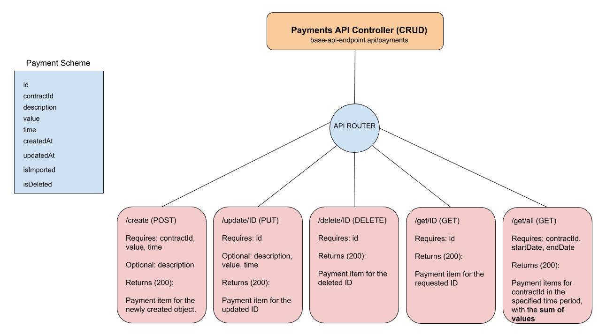

# nodejs-api-lambda-dynamodb
Asynchronous server-less REST API using vanilla nodejs, dynamodb for storage and aws lambda.

##### Flow Diagram


##### Structure
- main.js the root of the lambda function.
- routes.js the routing engine for directing the requests to their proper destination while validating the user input
- controllers/payments.js a controller for payments api
- models/payment.js to handle all payment specific database logic
- models/db.js a dynamoDB specific driver to handle the basic functions for our models

##### Deployment
- clone/download this repo
- zip the repo
- create a lambda function on aws, and upload the zipped repo, use the function name "paymentsApi" or update routes.js to reflect for the new name 
- create two dynamodb tables named "payments" with primary "id" field, and a table named "ids" with primary "table_name" field
- create the API gateway for aws based on the diagram above
- configure IAM to make sure to have the right permissions for the lambda function to access CloudWatch, DynamoDB, API Gateway

##### Usage
- to create a new payment item:
```
curl -X POST \
  https://aws-lambda.aws/paymentsApi/create \
  -d '{ "contractId" : 17689, "value": 100, "time": "2016-12-09T00:00:00.00Z", "description": "Rent for the 2nd month" }'
```
- to update a payment
```
curl -X PUT \
  https://aws-lambda.aws/paymentsApi/update/1389 \
  -d '{ "time": "2019-02-13T16:49:31.679Z", "description": "we updated all available attributes", "value": 200}'
```
- to get a payment
```
curl -X GET \
  https://fuu548k90l.execute-api.eu-central-1.amazonaws.com/default/paymentsApi/get/1365
```
- to get all payments for a time range for a specific contract
```
curl -X GET \
  https://fuu548k90l.execute-api.eu-central-1.amazonaws.com/default/paymentsApi/get/all \
  -H 'Content-Type: application/x-www-form-urlencoded' \
  -d '{ "contractId" : 17689, "startDate": "2016-12-01T12:57:09.708Z", "endDate": "2016-12-12T12:57:09.708Z" }'
```
- to delete a payment
```
curl -X DELETE \
  https://fuu548k90l.execute-api.eu-central-1.amazonaws.com/default/paymentsApi/delete/1387
```

- also all these curls are available as a postman collection `paymentsApi.postman_collection.json`

